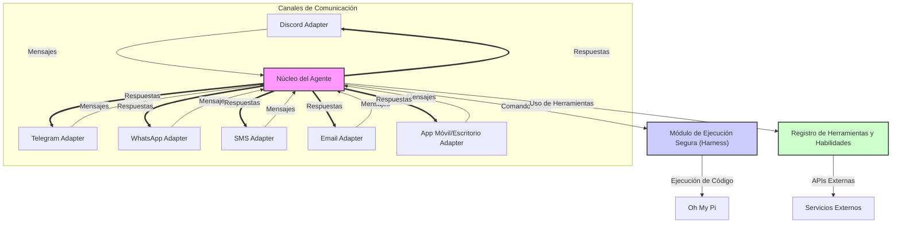

# Pio: Framework de Agentes LLM Multicanal

## Introducción

**Pio** es un framework modular y extensible, desarrollado en Rust, que permite la interacción con agentes de lenguaje de gran tamaño (LLM) a través de múltiples canales de comunicación. Inspirado en `omp-discord-bridge` y el concepto de *harness engineering*, este proyecto busca proporcionar una plataforma robusta y segura para desplegar agentes LLM en entornos como Discord, Telegram, WhatsApp, SMS, Email y aplicaciones nativas.

El objetivo principal es ofrecer una solución flexible donde los usuarios puedan habilitar o deshabilitar canales y funcionalidades según sus necesidades, manteniendo un enfoque en la seguridad y el aislamiento de la ejecución de código de los agentes.

## Características Principales

*   **Arquitectura Modular**: Los canales de comunicación y las herramientas se implementan como módulos opcionales, activables mediante *features* de Cargo.
*   **Soporte Multicanal**: Integración con diversas plataformas de comunicación para una interacción fluida con los agentes LLM.
    *   **Discord**: Basado en la funcionalidad de `omp-discord-bridge`.
    *   **Telegram**: Utilizando el framework `Teloxide`.
    *   **WhatsApp/SMS**: A través de APIs de terceros como Twilio.
    *   **Email**: Para envío y posible recepción de mensajes.
    *   **Aplicaciones Nativas**: Potencial integración con `Tauri` para interfaces de usuario de escritorio y móvil.
*   **Ejecución Segura (Harness)**: Un módulo dedicado a la ejecución aislada y controlada de comandos de agentes, inspirándose en `mongrelion/harness` para mitigar riesgos de seguridad.
*   **Gestión de Sesiones Persistentes**: Mantiene el contexto de la conversación del agente a través de diferentes interacciones y reinicios del servicio.
*   **Registro de Herramientas Extensible**: Permite a los agentes LLM descubrir y utilizar herramientas externas (APIs, funciones personalizadas) a través del `Model Context Protocol (MCP)`.
*   **Desarrollado en Rust**: Aprovecha la seguridad de memoria, el rendimiento y la concurrencia de Rust.

## Arquitectura

El framework se compone de un **Núcleo del Agente** agnóstico al canal, **Adaptadores de Canal** específicos para cada plataforma, un **Módulo de Ejecución Segura (Harness)** y un **Registro de Herramientas y Habilidades**.


 




## Configuración y Uso

### Prerrequisitos

*   [Rust](https://www.rust-lang.org/tools/install) (versión 1.82 o superior)
*   `Oh My Pi (OMP)` instalado y configurado.
*   Tokens de API para los canales deseados (Discord, Telegram, Twilio, etc.).

### 1. Clonar el Repositorio

```bash
git clone https://github.com/yoqer/pio.git

cd pio
```

### 2. Configurar Variables de Entorno

Copia el archivo `.env.example` a `.env` y edítalo con tus credenciales y configuraciones. Asegúrate de proporcionar los tokens para los canales que planeas usar.

```bash
cp .env.example .env
nano .env # o tu editor preferido
```

Ejemplo de `.env`:

```dotenv
# Configuración de Canales
DISCORD_TOKEN=tu_token_de_discord
TELEGRAM_TOKEN=tu_token_de_telegram
TWILIO_ACCOUNT_SID=tu_sid_de_twilio
TWILIO_AUTH_TOKEN=tu_token_de_auth_twilio

# Configuración de Email
SMTP_SERVER=smtp.gmail.com
SMTP_PORT=587
SMTP_USER=tu_email@gmail.com
SMTP_PASS=tu_password_de_aplicacion

# Configuración de OMP
OMP_PATH=omp
OMP_WORK_DIR=/home/usuario/agentes_sandbox

# Configuración de LLM Local (ej. LM Studio, llama.cpp)
LOCAL_LLM_API_BASE=http://localhost:8080/v1
LOCAL_LLM_MODEL_NAME=llama2
```

### 3. Compilar y Ejecutar

Para compilar el proyecto con los canales deseados, usa las *features* de Cargo. Por ejemplo, para habilitar Discord y Telegram:

```bash
cargo build --release --features "discord telegram"
```

Para ejecutar el framework:

```bash
cargo run --release --features "discord telegram"
```

**Nota**: Si no especificas ninguna *feature*, se compilarán los canales definidos en la *feature* `default` en `Cargo.toml` (actualmente Discord y Telegram).

### 4. Uso de Canales

Una vez en ejecución, el bot escuchará en los canales configurados. Por ejemplo, para Telegram, puedes interactuar con el bot que creaste en BotFather.

## Guía de Uso e Integración de Funciones

### Interacción con LLMs (API y Local)

Pio está diseñado para interactuar con agentes LLM, ya sea a través de APIs externas o modelos locales. La configuración se realiza a través de variables de entorno en el archivo `.env`.

*   **LLMs por API**: Si tu agente OMP está configurado para usar un LLM externo (ej. OpenAI, Claude, etc.), Pio simplemente reenviará las consultas y las respuestas. Asegúrate de que tu configuración de OMP apunte a la API correcta y que las claves estén en tu entorno.
*   **LLMs Locales (LM Studio, llama.cpp)**: Para usar modelos locales, como los servidos por LM Studio o llama.cpp, configura las siguientes variables en tu `.env`:
    ```dotenv
    LOCAL_LLM_API_BASE=http://localhost:8080/v1 # URL de tu servidor LLM local
    LOCAL_LLM_MODEL_NAME=llama2 # Nombre del modelo a usar
    ```
    El `AgentProcessor` de Pio puede ser extendido para detectar estas variables y dirigir las consultas a tu servidor LLM local. Esto permite un control total sobre el modelo y la privacidad de los datos.

### Estilo de Chat con LLMs

La interacción con los LLMs se realiza a través de los canales configurados. Por ejemplo, en Telegram, puedes enviar mensajes directamente al bot, y este los reenviará al agente OMP, que a su vez interactuará con el LLM. Las respuestas del LLM serán devueltas al canal de chat, manteniendo la continuidad de la conversación.

```text
Usuario: ¡Hola, agente! ¿Cuál es la capital de Francia?
Bot: La capital de Francia es París.
Usuario: ¿Y qué sabes sobre su gastronomía?
Bot: La gastronomía francesa es famosa mundialmente, con platos como el coq au vin, la bouillabaisse y los croissants.
```

### Funcionalidad de Contenedores (Harness)

Inspirado en `mongrelion/harness` y `Portable-AI-USB`, Pio incorpora un módulo de ejecución segura que permite ejecutar comandos de agentes en entornos aislados. Esto es fundamental para la seguridad al trabajar con código generado por LLMs.

El `HarnessModule` (en `src/harness/mod.rs`) es el punto de entrada para esta funcionalidad. Aunque la implementación actual utiliza `std::process::Command` para una demostración simple, la visión es extenderlo para soportar:

*   **Docker/Kubernetes**: Ejecución de comandos dentro de contenedores Docker o pods de Kubernetes para un aislamiento robusto y escalabilidad.
*   **Entornos Virtuales/Sandboxes**: Utilización de herramientas como `firejail` o `gVisor` para crear sandboxes ligeros.
*   **Modo Portable (USB/Carpetas)**: Inspirado en `Portable-AI-USB`, se puede configurar el `OMP_WORK_DIR` para que apunte a una carpeta específica en un USB o en una estructura de carpetas predefinida. Esto permitiría llevar el entorno de trabajo del agente de forma portátil.

Para activar la ejecución en Docker, puedes habilitar la feature `harness-docker` en `Cargo.toml` y configurar las variables de entorno necesarias para la conexión con Docker.

```bash
cargo build --release --features "telegram harness-docker"
```

## Desarrollo y Extensibilidad

### Añadir Nuevos Canales

Para añadir un nuevo canal de comunicación:

1.  Crea un nuevo módulo en `src/channels/` (ej. `src/channels/whatsapp.rs`).
2.  Implementa el trait `ChannelAdapter` para tu nuevo adaptador.
3.  Añade una nueva *feature* en `Cargo.toml` para tu canal y asegúrate de que las dependencias necesarias estén marcadas como `optional = true`.
4.  Actualiza `src/channels/mod.rs` para exportar tu nuevo módulo.
5.  Modifica `src/main.rs` para inicializar tu adaptador si la *feature* está activa y la variable de entorno correspondiente está presente.

### Añadir Nuevas Herramientas

El `Registro de Herramientas y Habilidades` (aún por implementar completamente) permitirá a los agentes acceder a nuevas funcionalidades. Esto se hará extendiendo el `Model Context Protocol (MCP)` para incluir llamadas a funciones personalizadas o APIs externas.


### -Otras optativas avanzadas.

#### Pio 2. [🐣🐥  Pio, Pio](https://github.com/yoqer/Pio-Harness/blob/main/README_1.md)
#### Pio 3. [🐣🐥🐤  Pio, Pio, Pio](https://github.com/yoqer/Pio-Harness/blob/main/README_2.md)

## Contribución

¡Las contribuciones son bienvenidas! Si deseas mejorar este framework, por favor, abre un *issue* o envía un *pull request*.

## Licencia

Este proyecto está licenciado bajo la licencia MIT. Consulta el archivo `LICENSE` para más detalles.

## Referencias

[1] Teloxide: An elegant Telegram bots framework for Rust. Disponible en: [https://github.com/teloxide/teloxide](https://github.com/teloxide/teloxide)
[2] Twilio: Cloud Communications Platform. Disponible en: [https://www.twilio.com/](https://www.twilio.com/)
[3] Tauri: Build smaller, faster, and more secure desktop applications with a web frontend. Disponible en: [https://tauri.app/](https://tauri.app/)
[4] Portable-AI-USB: Portable AI environment on a USB drive. Disponible en: [https://github.com/yoqer/IA-USB](https://github.com/yoqer/IA-USB)
